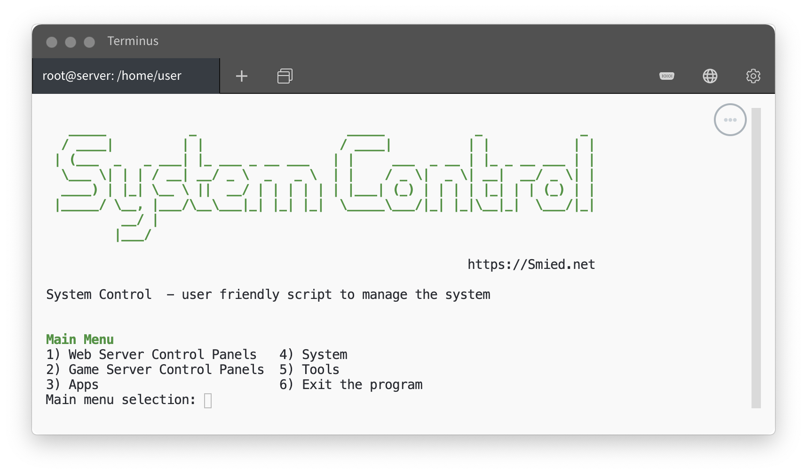

# System Control

[System Control](https://github.com/Smied-net/System-Control) - user friendly script to manage the system. Linux (Ubuntu)

 
**Smied.net links:**

[Website](https://Smied.net/) | [Documentation]() | [Feedback](https://Feedback.Smied.net/)

[Support](https://Help.Smied.net/) | [Community Support]()

# Screenshots

|  |
|:---------:|
| Linux |

### OS

* [Ubuntu](https://ubuntu.com/download)

# Use

1. Download: 

1.1 Download

`curl -O https://raw.githubusercontent.com/Smied-net/System-Control/main/systemcontrol.sh`

or

`wget https://raw.githubusercontent.com/Smied-net/System-Control/main/systemcontrol.sh`

or

1.1 Download & Install

`curl -O https://raw.githubusercontent.com/Smied-net/System-Control/main/systemcontrol.sh && sudo mv systemcontrol.sh /bin/systemcontrol && chmod +x /bin/systemcontrol`

 or

`wget https://raw.githubusercontent.com/Smied-net/System-Control/main/systemcontrol.sh && sudo mv systemcontrol.sh /bin/systemcontrol && chmod +x /bin/systemcontrol`

2. Start: 

2.1 `sudo bash systemcontrol.sh`

or

2.1 `sudo systemcontrol`

# Donate

# Main

## VPS

